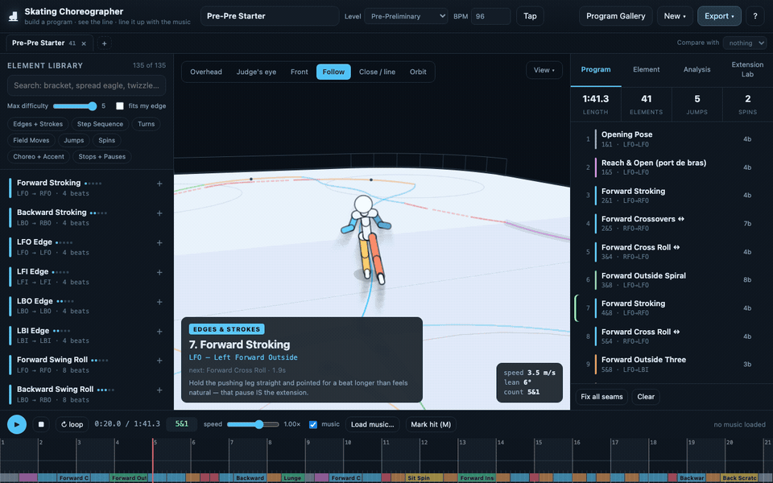
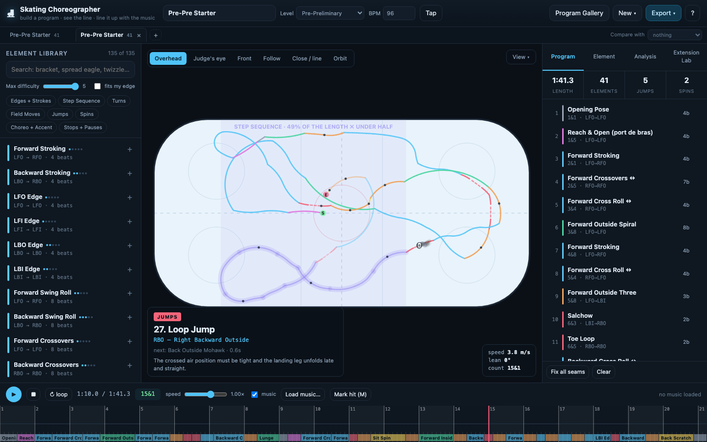
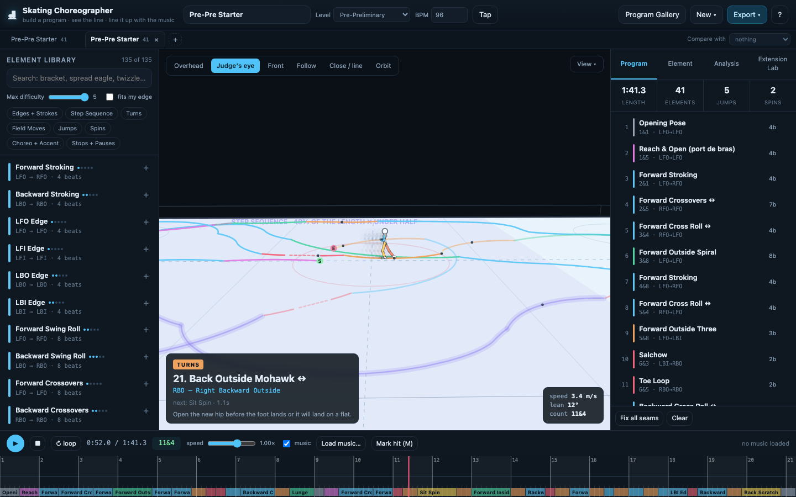
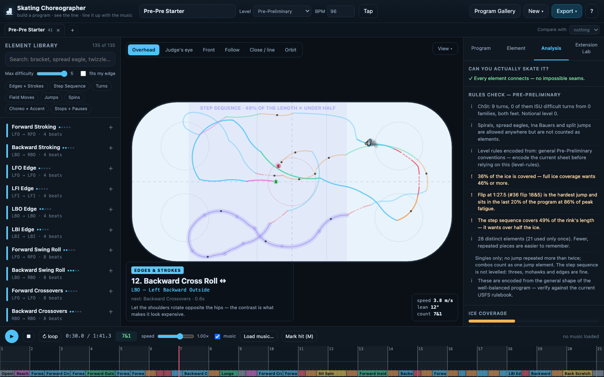
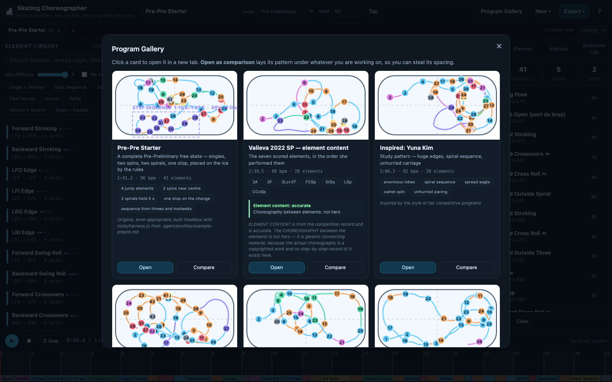

# Skating Choreographer

A figure skating choreography tool that runs entirely in the browser. Build a program element
by element, watch a 3D skater actually skate it from six camera angles, line it up with your
music, and export a pattern diagram and a coach sheet. Every element declares the edge it
starts and ends on, so the tracing on the ice is **computed** from the notation (`LFO` = left
forward outside), not drawn — and the same data catches "you can't get there from here"
before you are standing on the ice wondering why it does not work. **No install, no build
step, no dependencies.** Open `index.html` and it works, offline.



| | |
|---|---|
|  |  |
|  |  |

It also ships the other half: a set of **agent skills** and a **headless harness**, so a
skater can run the app locally and have a coding agent (Claude Code, Cursor, Codex, anything
that reads Markdown) build them a program that is *good* — on the music, placed on the ice by
the skater's own rules, at a speed they can actually skate, with the hands dancing the whole
way through — and prove it with numbers rather than adjectives. The skills were hardened by
running fresh agents against them, scoring what they built, and fixing the skills until the
last round reached zero rule misses in one steer, five times out of five.

---

## Quick start — the app

```
open index.html                              # macOS
python3 -m http.server 8777                  # or serve it: http://localhost:8777/index.html
```

Drop an mp3 anywhere on the window — it is decoded in your browser and never uploaded. You
get a waveform, BPM detection, tap tempo, an 8-count grid and hit markers (`M`). **Program
Gallery** in the top bar shows every built-in program as a card with its real pattern
diagram; open one, or open it as a grey comparison under your own. **New ▾** gives you a
blank program, a Remix of interchangeable sections (when you have a deck in `private/`), an auto-generated skeleton, a program
built from a pasted competition protocol, or **Import .json** for a save file the harness
made. **Export ▾** writes the save file, a pattern PNG, a CSV element list, and prints a
coach sheet or a pocket cheat card.

## Quick start — an agent builds your program

1. Clone the repo. Node is the only requirement for the harness (`node tools/harness.js`).
2. Copy `.agents/profiles/TEMPLATE.md` to `.agents/profiles/local-<you>.md` and fill in only
   what is true: level and element content, `speedScale`, the turns you know and do not,
   your taste in your own words, the counts your jumps and stops should land on.
   `.agents/profiles/example-prepre.md` is a filled-in (fictional) example. `local-*` files
   are gitignored — your profile is yours.
3. Put the file's name in `.agents/profiles/ACTIVE` (one line, no extension; also gitignored).
   To try the workflow before writing your own: `echo example-prepre > .agents/profiles/ACTIVE`.
4. Export the music envelope once. Your mp3 is never committed (it is gitignored); the
   measured onset envelope goes in `private/music/<track>-envelope.json` (yours, gitignored)
   or `music/` if you want to share it. The recipe — load the mp3 in the page, run a short
   snippet, POST it to `tools/inbox.py` — is in `.agents/skills/harness/SKILL.md`.
5. Tell your agent:

   > Build me a program to `<music>` for the skater in `.agents/profiles`.

What it will do, in the order `build-program` prescribes: read the skills and your profile,
read the envelope and design the layout **on paper** (which element on which musical moment,
and why), **chain** the elements edge-to-edge with an arm track and a note on every one,
**anchor** the jumps, spin and stops to your counts, **steer** the pattern onto the ice,
**verify** every number in the checklist, **score** the candidates against each other, save
the JSON, and **publish** it to the gallery so you can press play.

## The harness

`tools/harness.js` loads the app's own engine into Node, so every number it prints is the
number the app would show.

| Command | What it does |
|---|---|
| `node tools/harness.js verify <file.json \| presetId>` | Full JSON report: seams, speeds, off-ice, level rules, placement, ice use, step-sequence audit, arms, pose smoothness, music hits |
| `node tools/harness.js score <a.json> [b.json …]` | One comparable line per program: hard fails, rule misses, then the quality numbers |
| `node tools/harness.js chain <file.json \| presetId>` | The element list in counts, with edges and speeds, and total beats vs the music |
| `node tools/harness.js anchor <file> --at "flip#0=16,spin-camel-sit=54,stop-t#1=@141" [--out f]` | Lock elements to seconds or `@beat` numbers by adding glide in front of them |
| `node tools/harness.js steer <file> [--starts 0,-16,16,-32,keep] [--headings 0,180] [--frozen 0-12] [--verbose] [--out f]` | Place the pattern on the ice (aims only, never timing); several starts, keeps the best |
| `node tools/harness.js envelope [--bucket 2]` | The music's measured energy, bucketed and normalised, in program time and counts |
| `node tools/harness.js lib [category] [--speedScale 0.8]` | Every library element with entry/exit edges, beats, distance, minimum beats and natural curl |

Preset ids work wherever a file does. `tools/inbox.py` is a tiny receiver so the page can
hand frames and JSON back to the repo; `tools/json2preset.js` turns save files into gallery
cards; `tools/publish-local.sh` builds `js/local.js` — your gallery cards and, if you have
one, your Remix deck — from `private/`, which is gitignored. Your programs live on your
machine; the repo stays shareable.

## The skills

`.agents/skills/` is agent-agnostic; `.claude/skills` is a symlink to it so Claude Code
picks them up unchanged. One line each:

| Skill | What it covers |
|---|---|
| `build-program` | The order of everything: music → layout on paper → chain → arms → anchor → steer → verify → score → publish |
| `program-craft` | The general rules of a program that reads as choreography: placement, connecting material, jump entries, rotation, music, highlights, speed, how the steer enforces them |
| `skater-profile` | Where the skater's own rules live (`.agents/profiles/`), that they outrank the general ones, and how to write a new one |
| `music-mapping` | Reading the envelope: hits, silences, plateaus, builds, and which element belongs on each |
| `step-sequence` | A ChSt that audits well: difficult-turn families, two clusters on different feet, both directions, the count budget, an exit on the next jump's edge |
| `arm-choreography` | The `arms:` track, 45 named shapes, 9 moving phrases, hand shapes, what suits which moment, and the per-element hand note |
| `level-rules` | USFS Aspire 4 as encoded (caps, required spin, combinations, what a ChSt is) and how to add a level |
| `verify-program` | The measured checklist every change must pass, plus the regression that every preset still builds |
| `harness` | The CLI above, its gotchas, and how to get the envelope and frames out of the page |
| `section-variants` | Authoring Remix variants against the entry/exit/beats contract |
| `repo-gotchas` | What looks broken but is not, edits that silently destroy data, animation bugs that recur |

## The rules the numbers enforce

The thresholds are `PLACE` in `js/engine.js`; the app's rules panel (`checkPlacement`) and
the harness `verify`/`score` measure every one. The skater's profile can override them.

| Rule | Number |
|---|---|
| The whole routine stays on the ice | `offIce` = 0 (hard fail) |
| Spins near centre | ≤ 7 m from centre |
| Jumps at centre or in a corner | within 9 m of centre or a corner circle |
| Comfortable jump entries | no awkward edge before a takeoff; a speed builder in the two elements before it |
| Both ends of the rink used | each end third ≥ 18% of the skating |
| Both sides used | each side third ≥ 18% |
| Every corner visited | ≥ 0.8 s inside each corner circle |
| Coverage | ≥ 46% of the rink's 2 m cells |
| Crossovers skated on an edge | each run a lobe of 70–200° on a 4–9 m radius |
| Speed builders | ≥ 35% of the connecting beats are crossovers, stroking, power pulls, swing rolls, cross rolls |
| Step sequence over half the ice | its footprint ≥ 50% of the rink's length (panel warns under 45%) |
| Realistic speed | per-category caps (turns 5.2, edges 5.3, field/choreo 5.0, stops 4.5, jumps 7.0 m/s at Aspire 4); `speedScale` shrinks the library's distances |
| Rotation balance | 42–58% of the turning is counter-clockwise |
| No dead ice | every glide (`gapBefore`) ≤ 1.5 s |
| Start and finish near centre | ≤ 7 m |
| Arms on every element | every element carries its own `arms` track; ≥ 34% of the step sequence has authored arm movement |
| Level rules | Aspire 4 caps, the required camel→sit, one ChSt (`checkAspire`) |

## How it was built, and how it was tested

**The engine.** Every library element declares the edge it enters and exits on (`LFO`,
`RBI`, …) and a list of phases (arcs with a radius, lines, air, spin). `buildPath` integrates
those into a 50 Hz path on a 60 × 30 m rink — position, heading, lean, skating foot, air —
so a program's tracing is a consequence of the notation, seams are string equality on edge
codes, and every number the verifier reports (speed, distance to the boards, revolutions,
which foot for how long) is read off the same samples the renderer draws. `speedScale`
shrinks travel and lobe radii together so a learner's program is slower without changing
the shapes; a jump travels at the speed it was approached at; spins turn at the level's rate.

**The verifier** is ~40 rules, each a value against a floor in one table (`PLACE` in
`js/engine.js`) and each reported with the element that misses it and a lever to pull —
see the table above. The level's own rules (caps, permitted jumps, required spin, what a
step sequence is) are encoded from the federation's sheet with the source cited.

**The steer** chooses each element's `aim` (a direction change at its start; never timing):
a greedy pass over every element, joint searches over the approach to any jump or spin
still out of place, a stage that stretches the step sequence across half the ice, a stage
that sends a corner jump to the under-used end, and a final polish against the rule score
itself — from several starting aims and both start headings, keeping the best.

**The arms** are their own keyframe track over the body pose (45 shapes, 9 moving phrases),
re-timed per element by the engine so no move is faster than a real arm, with long
cross-fades at seams and foot changes; the harness measures the hands' peak speed.

**The eval loop.** `experiments/` documents how the skills were hardened: a brief written
the way the skater would say it, five fresh agents with no conversation history building a
program each from the skills alone, the harness scoring them, and for every miss the
question *which skill should have prevented it, and what sentence was missing*. Three
rounds, fifteen programs (one skater's; not shipped — the results are). Round 2 needed
4–31 steers per program to reach zero rule misses; after the engine and skill fixes it
found, round 3 needed **one, five times out of five**. Protocol and round table:
[`experiments/README.md`](experiments/README.md); the last round's findings and fixes:
[`experiments/round-3/results.md`](experiments/round-3/results.md).

**The critics.** The verifier itself was then reviewed by three independent agents — a
coach/technical specialist, a software engineer with deliberately broken inputs, and an
agent that had to use it cold — and their 36 findings drove the current rule set: the
coach found that a library element skated its last phase on the wrong edge, so the seam
check passed while both Lutzes were taking off from an inside edge; jumps landing 4 m from
the boards that the engine had been quietly steering around; a scratch spin at 3.8 rev/s;
an eight-second run on one foot in the step sequence. The engineer found that the program
length and arm tracks were counted but never validated. The user found three rulebooks that
disagreed. All fixed, all now measured.

## Files

```
index.html                 layout
css/app.css                styles
js/util.js                 vector math, formatting, 8-count helpers
js/poses.js                skeleton, 47 body poses, 45 arm shapes, 9 arm phrases, blending
js/library.js              the 136-element library — the content heart
js/engine.js               edge model, path integration, analysis, level rules, PLACE, the steer
js/render.js               the hand-written 3D renderer and the flat pattern diagram
js/music.js                audio decode, waveform, onset envelope, BPM + phase detection
js/presets.js              built-in programs, study patterns, auto-generator, seam repair
js/local.js                YOUR gallery cards and Remix deck, built from private/ (gitignored)
js/export.js               json / png / csv / coach sheet / pocket card
js/app.js                  state and all UI wiring
tools/harness.js           the engine in Node: verify, score, chain, anchor, steer, envelope, lib
tools/inbox.py             local receiver for frames and JSON POSTed from the page
tools/json2preset.js       save file -> gallery preset
tools/publish-local.sh     builds js/local.js from private/ (programs, remix deck)
tools/screenshots.sh       the README stills, via headless Chrome and the ?preset&t&cam deep links
tools/demo-gif.sh          the README gif (frames through the deep link, ffmpeg)
.agents/skills/             the skills (agent-agnostic; .claude/skills symlinks here)
.agents/profiles/           TEMPLATE.md, example-prepre.md; local-*.md and ACTIVE are yours (gitignored)
private/                   your programs, envelopes, remix deck — gitignored, see publish-local.sh
music/                     shared envelopes, if any (the mp3s themselves are gitignored)
experiments/               the skill-hardening rounds: briefs and results
docs/CHOREOGRAPHY.md       how real programs are built: ISU difficult turns, entries, layout
docs/PLAN.md               the original design doc (history)
*.json                     the skater's programs in the app's save format
```

## Honest limits

- Programs have two separable layers, and this tool treats them differently and says which
  is which: **element content** (which jumps and spins, in what order) is published fact and
  can be exact; **choreography** (the pattern, the transitions, the movement) is a
  copyrighted creative work and is never reproduced. The Valieva preset has accurate element
  content on invented connecting material and is labelled that way; the Yuna Kim and Alysa
  Liu presets are looser *style* studies.
- Level rules encode the USFS well-balanced program for Pre-Preliminary through
  Pre-Juvenile in general shape, and Aspire 4 from the published sheet. Rules change yearly
  — verify against the current rulebook before calling anything legal. Revolutions in a spin
  cannot be counted.
- The placement thresholds (`PLACE` in `js/engine.js`) were set with one skater and one
  track. Another skater's profile can disagree; the general craft in `program-craft` is
  meant to hold, the numbers are meant to be edited.
- The harness finds the envelope as `music/<track>-envelope.json` from the program's
  `musicName` (or `--track`); export one per track from the page first.
- The skater is a stylised model for reading **line and pattern**. It will not tell you
  whether you can land the double. Speed is distance over beats, so it is only as honest as
  `speedScale` and the library's nominal distances.
- BPM detection is energy-based. It is solid on anything with a pulse and unreliable on
  rubato lyrical or classical music — use **Tap** there, which is what choreographers do
  anyway. Loading music resets bpm and offset; set them again.
- There is no autosave. Reloading the page loses the open program and the music; the save
  file is the record.

## Deep links

`index.html?preset=<id>&t=<seconds>&cam=<overhead|judge|front|follow|close|orbit>&tab=<prog|element|anal|ext>&gallery=1`
opens a program at a moment, from a camera, on a tab — for sending someone a link to a
moment in a program, and for the screenshot scripts.

## Keyboard

`space` play/pause · `←→` scrub (shift = 1 s) · `↑↓` prev/next element · `L` loop selected ·
`M` mark a musical hit · `T` cycle tracing modes · `tab` next program · `1`–`6` cameras ·
`delete` remove selected
